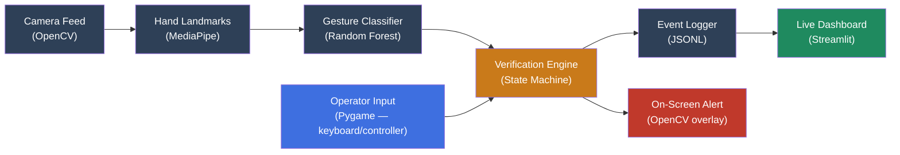

# CraneIQ

**Edge AI crane safety verification — checking that operator actions match rigger hand signals, in real time, fully offline.**

CraneIQ is an intent-verification layer for crane operations. It doesn't just recognize hand gestures — it cross-checks what a ground rigger signals against what a crane operator actually does, and fires an instant alert the moment the two disagree.

---

## Table of Contents

- [Problem](#problem)
- [Solution](#solution)
- [Architecture](#architecture)
- [Tech Stack](#tech-stack)
- [Project Structure](#project-structure)
- [Setup](#setup)
- [Running the Project](#running-the-project)
- [Verification States](#verification-states)
- [Current Status](#current-status)
- [Known Limitations](#known-limitations)
- [Future Enhancements](#future-enhancements)
- [Team](#team)

---

## Problem

Crane accidents are frequently caused by miscommunication between a ground rigger and a crane operator, not mechanical failure. Signals get misread, missed due to dust or glare, or executed incorrectly — and by the time the mistake is visible, the load is already swinging.

Existing crane safety systems (load monitoring, anti-collision radar, visibility cameras) focus on mechanical and environmental safety. None of them verify that the operator's action actually matches the rigger's signaled intent. That's the gap CraneIQ targets.

## Solution

A four-stage real-time pipeline:

1. **Detect** — a camera reads the rigger's hand in real time
2. **Classify** — a trained model identifies which standardized signal is being shown
3. **Compare** — a verification engine checks the signal against the operator's actual control input
4. **Alert** — on mismatch, delay, or no response, the system flags it instantly on screen and logs it

The system runs entirely offline on a laptop CPU — no cloud inference, no external API calls, no paid tools.

---

## Architecture



**Data flow, step by step:**

1. `1_camera_test.py` / `4_live_demo.py` opens a webcam feed via OpenCV
2. Each frame is passed to `utils/hand_tracker.py`, which uses **MediaPipe Hands** to extract 21 landmark points (x, y, z) per detected hand
3. The landmark vector is fed into a **Random Forest classifier** (`gesture_model.pkl`, trained by `3_train_model.py` on data from `2_collect_data.py`) to identify the signaled gesture: `STOP`, `BOOM_UP`, `BOOM_DOWN`, `SWING_LEFT`, `SWING_RIGHT`, or `HOIST`
4. In parallel, `operator_input.py` renders a simulated crane cabin and captures keyboard/controller input as the "operator action" — standing in for real CAN bus telemetry in a production system
5. Both signals feed into `verification_engine.py`, a state machine that compares the confirmed gesture against the operator's action within a defined response window
6. Every resolved event is written to `logs/events.jsonl` via `logger.py`
7. `dashboard.py` (Streamlit) reads that log file and displays it live, auto-refreshing every 2 seconds

---

## Tech Stack

| Technology | Role |
|---|---|
| **Python** | Core language for the entire pipeline |
| **OpenCV** | Real-time video capture and frame processing |
| **MediaPipe** | 21-point hand landmark detection, CPU-only |
| **Scikit-learn** (Random Forest) | Gesture classification from landmark coordinates |
| **Pygame** | Simulated operator input (keyboard/controller), stands in for CAN bus |
| **Streamlit** | Live mismatch dashboard |
| **Git/GitHub** | Version control across a 4-person team |

All tools are free and open-source. No cloud services, no paid APIs.

---

## Project Structure

```
CraneIQ/
│
├── README.md
├── requirements.txt
├── .gitignore
│
├── scripts/
│   ├── 1_camera_test.py        # Camera + MediaPipe sanity check
│   ├── 2_collect_data.py       # Records labeled gesture landmark data
│   ├── 3_train_model.py        # Trains the Random Forest classifier
│   └── 4_live_demo.py          # Full pipeline: camera + operator sim + verification
│
├── utils/
│   └── hand_tracker.py         # Shared MediaPipe landmark extraction (imported by scripts above)
│
├── operator_input.py           # Pygame crane cabin simulator + input capture
├── verification_engine.py      # Core intent-verification state machine
├── logger.py                   # Appends verification events to logs/events.jsonl
├── dashboard.py                # Streamlit live dashboard
│
├── data/
│   └── gesture_data.csv        # Labeled training data (gitignored)
├── model/
│   └── gesture_model.pkl       # Trained classifier (gitignored)
└── logs/
    └── events.jsonl            # Live verification event log (gitignored)
```

---

## Setup

**1. Clone the repo**
```bash
git clone https://github.com/<your-username>/CraneIQ.git
cd CraneIQ
```

**2. Create and activate a virtual environment**
```bash
python -m venv venv

# Windows
venv\Scripts\activate

# Mac/Linux
source venv/bin/activate
```

**3. Install dependencies**
```bash
pip install -r requirements.txt
```

---

## Running the Project

Run each stage in order the first time you set up the project:

**Step 1 — Verify your camera and hand tracking work**
```bash
python scripts/1_camera_test.py
```
A window should open showing your webcam feed with a hand-landmark overlay. Press `q` to quit.

**Step 2 — Collect gesture training data**
```bash
python scripts/2_collect_data.py
```
Follow the on-screen countdown and hold each gesture steady for the recording window. Repeat across multiple people/sessions for a more robust dataset.

**Step 3 — Train the classifier**
```bash
python scripts/3_train_model.py
```
Prints accuracy, a confusion matrix, and a classification report, then saves `gesture_model.pkl`.

**Step 4 — Run the full live demo**
```bash
python scripts/4_live_demo.py
```
Opens the camera feed and the operator cabin simulator side by side. Show a gesture, then respond with the matching key:

| Key | Action |
|---|---|
| `W` | BOOM UP |
| `S` | BOOM DOWN |
| `A` | SWING LEFT |
| `D` | SWING RIGHT |
| `H` | HOIST |
| `Space` | STOP |

**Step 5 — View the live dashboard** (in a separate terminal, with Step 4 still running)
```bash
streamlit run dashboard.py
```

---

## Verification States

The verification engine resolves every gesture into one of these states:

| State | Meaning |
|---|---|
| `MATCH` | Operator responded correctly, within the response window |
| `DELAYED_ACTION` | Operator responded correctly, but slower than expected |
| `MISMATCH` | Operator's action does not match the signaled gesture |
| `NO_ACTION` | No operator response was detected before timeout |
| `WAITING_FOR_RESPONSE` | Gesture confirmed, awaiting operator input |
| `UNCERTAIN` | Gesture detected but not confidently classified |
| `IDLE` | No active gesture |

---

## Current Status

This is a working hackathon prototype, not a production system.

- [x] Camera capture and real-time hand landmark detection
- [x] Gesture dataset collected and Random Forest classifier trained
- [x] Simulated operator input (keyboard + game controller support)
- [x] Verification engine with full state machine
- [x] Live dashboard with auto-refresh
- [x] End-to-end pipeline tested and validated on local test cycles

## Known Limitations

- **Simulated operator input**: keyboard/controller input stands in for real CAN bus telemetry — no physical crane hardware is involved
- **Single-standard training**: the classifier is trained on OSHA/ANSI hand signals; other regional standards (CPCS, ISO 16715) would require retraining
- **Limited dataset diversity**: trained on a small number of team members' hands; accuracy may vary for hands, lighting, or gloves outside the training distribution
- **Advisory only, by design**: the system never interfaces with or controls crane hardware — it only detects and alerts, informed by feedback from an experienced crane operator that automated control has no place in this safety loop

## Future Enhancements

- Real CAN bus integration to replace simulated operator input
- Support for multiple regional hand-signal standards
- Deployment to dedicated edge hardware (e.g., NVIDIA Jetson) for permanent site installation
- Predictive load-swing / struck-by collision detection as a complementary safety layer
- Larger, multi-site training dataset across more operators and conditions

---

## Team

| Role | Focus |
|---|---|
| Computer Vision | Camera capture, MediaPipe landmark extraction |
| ML / Data | Gesture data collection, Random Forest training |
| Verification & Integration | Operator input, mismatch engine, full pipeline integration |
| Dashboard & Documentation | Streamlit dashboard, README, presentation |

---

*Built as a hackathon proof of concept. Not intended for deployment on active crane sites without further validation, testing, and operator input.*